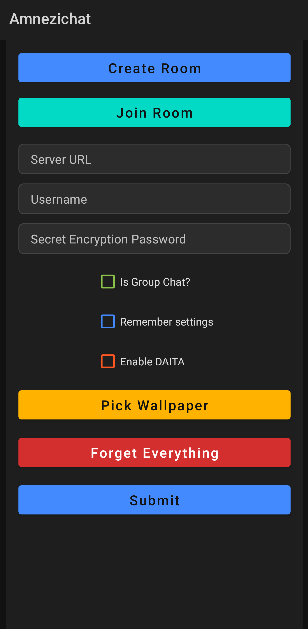

# Amnezichat_Mobile

## RAM-only secure messenger for smartphones

<!-- DESCRIPTION -->
## Description:

RAM-only secure messengers offer enhanced privacy and security by minimizing data persistence and exposure. A RAM-only system ensures that all user data, including messages and encryption keys, are stored temporarily in volatile memory (RAM) rather than on a hard drive, which significantly reduces the risk of data retrieval after shutdown or compromise.

<!-- FEATURES -->
## Features:

- ChaCha20-Poly1305 for E2E encryption

- Ed25519 and X25519 for ephemeral key exchange

- Argon2id for key derivation with memory cost of 19456KB, iterations of 2, and parallelization of 1

- DAITA option (Defense against AI-guided Traffic Analysis)

- Client doesn't log anything to storage

- Each message is stored encrypted in server's RAM and wiped after 10 minutes

- Built in Java

<!-- INSTALLATION -->
## Installation:

### Option 1:

Download the latest APK from the [Releases Section](https://github.com/Amnezichat/Amnezichat_Mobile/releases/latest).

### Option 2:

Build it yourself using [Android Studio](https://developer.android.com/studio).

<!-- SCREENSHOTS -->
## Screenshots:

    
    

<!-- LICENSE -->
## License

Distributed under the GPLv3 License. See `LICENSE` for more information.

## Donate to support development of this project!

**Monero(XMR):** 88a68f2oEPdiHiPTmCc3ap5CmXsPc33kXJoWVCZMPTgWFoAhhuicJLufdF1zcbaXhrL3sXaXcyjaTaTtcG1CskB4Jc9yyLV

**Bitcoin(BTC):** bc1qn42pv68l6erl7vsh3ay00z8j0qvg3jrg2fnqv9
